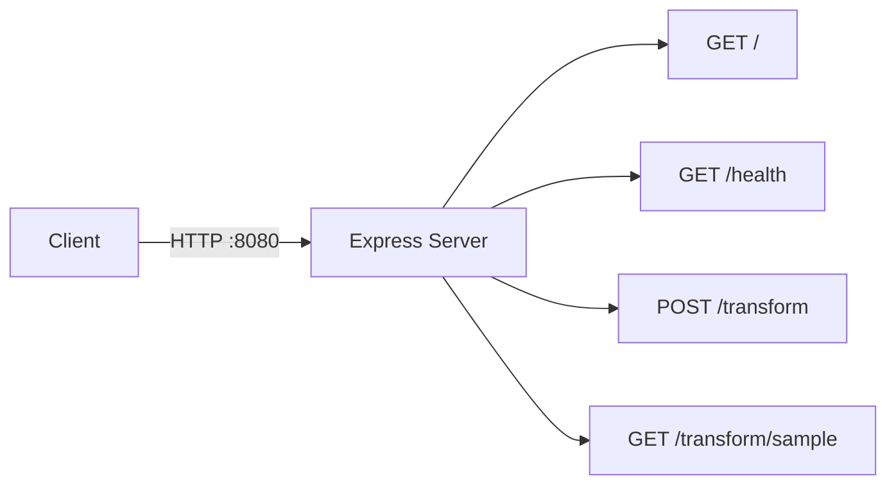
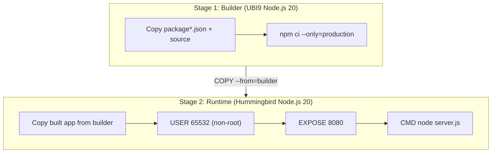
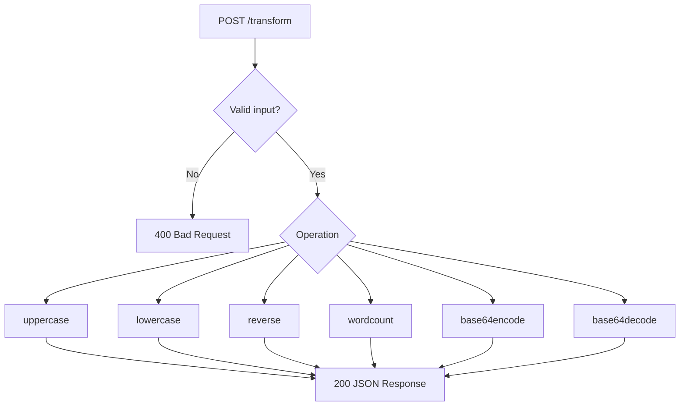

# sample-nodejs-hummingbird

A sample Node.js HTTP application built on [Red Hat Hummingbird](https://github.com/hummingbird-project) container images. Used as the Node.js test case for **Module 2.2 (Custom Build Strategies)** in the Zero-CVE Hummingbird Workshop.

Demonstrates that Hummingbird images can run production Node.js applications (Express) while maintaining a **zero-CVE posture** at the OS layer.

## Architecture



## Container Build

The application uses a multi-stage container build. Dependencies are installed in a full UBI9 Node.js builder image, then copied to the minimal Hummingbird runtime image.



| Image | Purpose |
|-------|---------|
| `registry.access.redhat.com/ubi9/nodejs-20:latest` | Builder -- installs npm dependencies |
| `quay.io/hummingbird-hatchling/nodejs:20` | Runtime -- minimal zero-CVE base |

## Transform API Flow

The `/transform` endpoint accepts a JSON body with `text` and `operation` fields and returns the transformed result.



## Endpoints

| Method | Path | Description |
|--------|------|-------------|
| `GET` | `/` | Runtime info -- Node.js version, Express version, V8 version, platform, architecture |
| `GET` | `/health` | Health check -- returns `{"status": "healthy"}` |
| `POST` | `/transform` | Text transformation -- accepts `{"text": "...", "operation": "..."}` |
| `GET` | `/transform/sample` | Quick test -- runs a hardcoded uppercase transformation |

### Supported Transform Operations

| Operation | Example Input | Example Output |
|-----------|--------------|----------------|
| `uppercase` | `hello world` | `HELLO WORLD` |
| `lowercase` | `HELLO WORLD` | `hello world` |
| `reverse` | `hello` | `olleh` |
| `wordcount` | `hello world` | `2` |
| `base64encode` | `hello` | `aGVsbG8=` |
| `base64decode` | `aGVsbG8=` | `hello` |

## Quick Start

### Run Locally

```bash
npm install
npm start
```

The server starts on port **8080**.

### Build and Run Container

```bash
# Build
podman build -f Containerfile -t sample-nodejs-hummingbird .

# Run
podman run -p 8080:8080 sample-nodejs-hummingbird
```

## Verification

```bash
# Runtime info
curl http://localhost:8080/

# Health check
curl http://localhost:8080/health

# Sample transformation
curl http://localhost:8080/transform/sample

# Custom transformation
curl -X POST http://localhost:8080/transform \
  -H "Content-Type: application/json" \
  -d '{"text": "hello world", "operation": "uppercase"}'
```

## CI/CD

GitHub Actions runs on every push and pull request to `main`:

1. **Lint & Test** -- installs dependencies and verifies all endpoints respond correctly
2. **Container Build** -- builds the Containerfile and smoke-tests the running container
3. **Security Scan** -- runs [Grype](https://github.com/anchore/grype) (fails on High/Critical) and generates an SBOM with [Syft](https://github.com/anchore/syft)

[Dependabot](.github/dependabot.yml) is configured for weekly updates of npm packages and GitHub Actions.

## License

MIT
